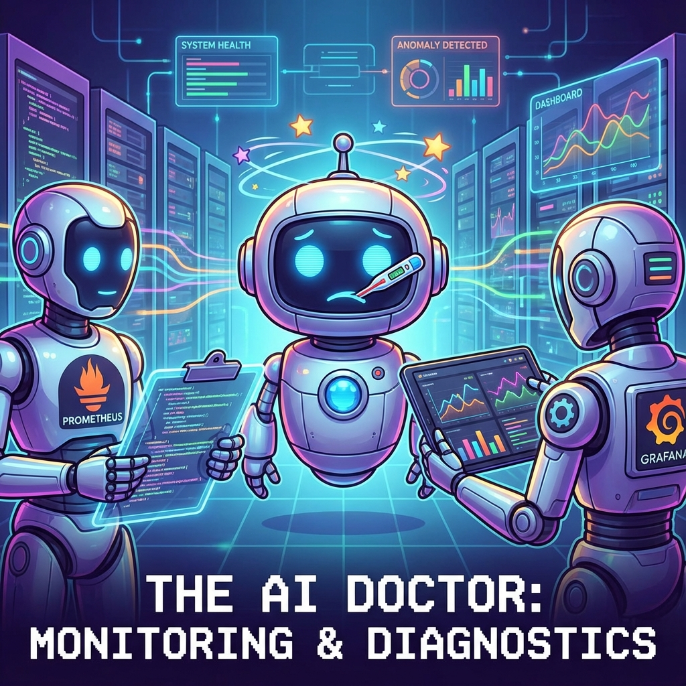
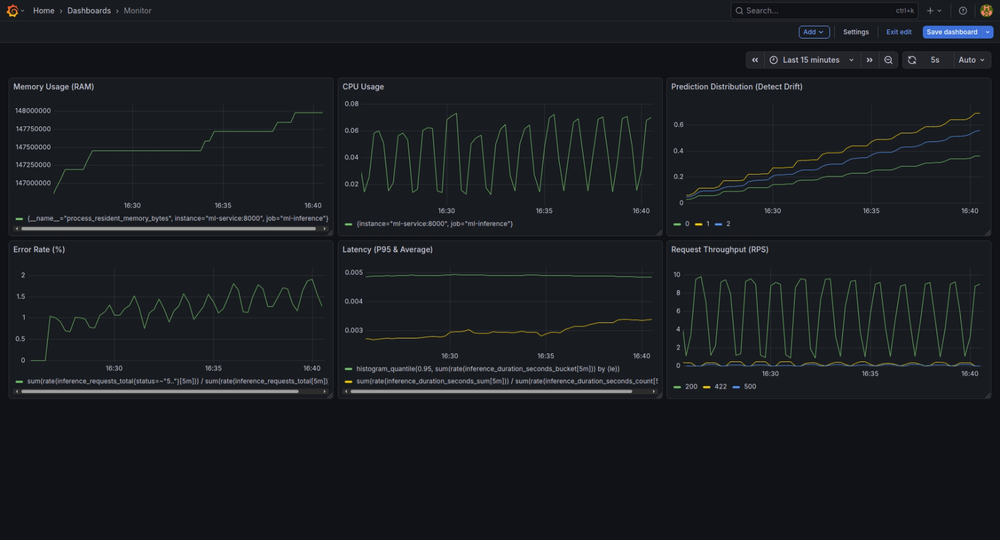

# Khi Model "Hắt hơi sổ mũi": Xây dựng hệ thống khám bệnh tự động với Prometheus & Grafana

<div align="center">
  
</div>


Chào mọi người hôm nay chúng ta sẽ cùng nhau bàn về một chủ đề mà mình tin là bất cứ ai làm về AI/Machine Learning, đặc biệt là khi đưa model ra thực tế (Production), đều sẽ gặp phải. Đó là câu chuyện: **Làm sao biết model của mình còn "sống" hay đã "ngắc ngoải"?**

## 1. "Lời nguyền" của môi trường Production

Hãy tưởng tượng kịch bản quen thuộc này:
Bạn train một model phân loại ảnh đạt 99% accuracy ở máy local. Bạn hì hục đóng gói, deploy lên server. Sếp hỏi: *"Model chạy ổn không em?"*. Bạn check log thấy API trả về `status 200 OK` đều đặn và tự tin trả lời: *"Ổn áp lắm anh ơi!"*.

Nhưng rồi... một tuần sau, team CSKH báo về là khách hàng phàn nàn model dự đoán sai tùm lum. Bạn hoang mang tột độ. Hóa ra, dữ liệu ảnh khách hàng gửi lên khác hoàn toàn với tập train (Data Drift), hoặc server bị quá tải khiến model trả lời chậm như rùa bò (High Latency).

**Bài học xương máu:** `Status 200` là chưa đủ. Nó chỉ cho biết server còn sống, chứ không cho biết model có "khỏe" hay không. Chúng ta cần một hệ thống giám sát sâu hơn thế.

## 2. Tại sao cần "Khám sức khỏe" cho AI?

Nếu ví hệ thống của bạn là một cơ thể, thì:
- **Server Monitoring (Giám sát hạ tầng):** Giống như đo nhịp tim, huyết áp (CPU, RAM, Disk). Cái này DevOps lo.
- **AI Monitoring (Giám sát mô hình):** Giống như xét nghiệm máu, chụp X-quang để tìm bệnh tiềm ẩn. Cái này AI Engineer (là chúng ta) phải lo.

Chúng ta cần theo dõi những chỉ số "sinh tồn" sau:
1.  **Latency (Độ trễ):** Model suy luận mất bao lâu? Chậm quá thì trải nghiệm người dùng sẽ rất tệ.
2.  **Throughput (Lưu lượng):** Có bao nhiêu request mỗi giây? Hệ thống có đang chịu tải cao không?
3.  **Data Drift (Trôi dạt dữ liệu):** Dữ liệu thực tế có còn giống lúc train không? Hay là "hoa hậu" lúc train ra đời thực thành "thị nở"?
4.  **Prediction Distribution:** Model có đang dự đoán thiên lệch về một class nào đó không?

## 3. Giới thiệu "Bác sĩ" & "Y tá": Prometheus & Grafana

Để xây dựng hệ thống "khám bệnh" tự động này, chúng ta sẽ dùng bộ đôi huyền thoại trong làng monitoring:

*   **Prometheus (Bác sĩ thu thập):** Anh chàng này rất cần mẫn. Cơ chế hoạt động của anh ấy là **Pull** (Kéo). Cứ mỗi vài giây, anh ấy sẽ đi "gõ cửa" từng service của bạn và hỏi: *"Này, có chỉ số gì mới không? Cho xin cái số liệu!"*. Sau đó anh ấy ghi chép lại vào cuốn sổ tay (Time Series Database).
*   **Grafana (Hồ sơ bệnh án):** Cô nàng này thì rất khéo tay. Cô ấy lấy dữ liệu khô khan từ sổ tay của Prometheus và vẽ thành những biểu đồ (Dashboard) cực kỳ trực quan, đẹp mắt. Nhìn vào đó, bạn biết ngay bệnh tình của hệ thống mà không cần đọc từng dòng log.

## 4. Thực chiến: Bắt tay vào làm (Hands-on)

Lý thuyết đủ rồi, giờ chúng ta cùng xắn tay áo lên làm một hệ thống giám sát đơn giản nhé!

**Bài toán:** Chúng ta sẽ deploy một model phân loại hoa Iris (bài toán kinh điển) và giám sát nó.

### Kiến trúc hệ thống
Chúng ta sẽ dùng **Docker Compose** để dựng 3 container:
1.  **ML Service:** Chạy model bằng FastAPI.
2.  **Prometheus:** Thu thập metrics.
3.  **Grafana:** Hiển thị biểu đồ.

### Bước 1: Gắn "cảm biến" vào code (Instrumentation)

Trong code Python (FastAPI), chúng ta dùng thư viện `prometheus_client` để tạo các metrics.

```python
# server/app.py
from prometheus_client import Counter, Histogram

# Đếm tổng số request
REQUESTS_TOTAL = Counter('inference_requests_total', 'Total requests', ['status'])

# Đo thời gian xử lý (Latency)
DURATION_SECONDS = Histogram('inference_duration_seconds', 'Inference duration')

@app.middleware("http")
async def monitor_requests(request: Request, call_next):
    start_time = time.time()
    response = await call_next(request)
    
    # Ghi nhận metrics sau khi xử lý xong
    process_time = time.time() - start_time
    REQUESTS_TOTAL.labels(status=response.status_code).inc()
    DURATION_SECONDS.observe(process_time)
    
    return response
```

### Bước 2: Cấu hình Prometheus

Khai báo cho Prometheus biết địa chỉ của ML Service để nó đến lấy dữ liệu.

```yaml
# monitoring/prometheus.yml
scrape_configs:
  - job_name: "ml-inference"
    scrape_interval: 5s
    static_configs:
      - targets: ["ml-service:8000"]
```

### Bước 3: Dựng Dashboard trên Grafana

Sau khi chạy `docker-compose up -d`, bạn vào Grafana, kết nối với Prometheus và tạo các biểu đồ.

Chúng ta có thể dùng ngôn ngữ truy vấn **PromQL** để vẽ:
-   **Tốc độ request (RPS):** `rate(inference_requests_total[1m])`
-   **Độ trễ trung bình:** `rate(inference_duration_seconds_sum[1m]) / rate(inference_duration_seconds_count[1m])`

### Kết quả Demo

<div align="center">
  
</div>

Nhìn vào Dashboard (ảnh trên), chúng ta có thể thấy rõ ràng "bệnh án" của model được phơi bày chi tiết qua từng biểu đồ:

1.  **Request Throughput:** Biểu đồ này cho thấy nhịp tim của hệ thống. Lưu lượng request không đều, có những đợt tăng vọt (High Load) thể hiện qua các đỉnh nhọn.
2.  **Latency P95 & Avg:** Đây là chỉ số quan trọng nhất về trải nghiệm người dùng. Đường màu xanh (P95) và vàng (Avg) biến động mạnh khi hệ thống chịu tải cao. Khi Latency tăng thì đó là dấu hiệu server đang "khó thở".
3.  **Error Rate:** Bình thường đường này nằm im ở mức 0%. Nhưng khi có sự cố (như kịch bản Error Storm), nó dựng đứng lên, báo động cho thấy hệ thống đang trả về lỗi hàng loạt.
4.  **Prediction Distribution:** "Máy phát hiện nói dối" của chúng ta. Các cột màu đại diện cho các lớp hoa (Setosa, Versicolor, Virginica). Khi dữ liệu đầu vào bị Drift (hoa đột biến), tỷ lệ các cột này thay đổi bất thường so với phân phối chuẩn, báo hiệu model cần được train lại.
5.  **Resource Usage:** CPU và RAM (Memory) cũng "nhảy múa" tương ứng với lượng request, giúp chúng ta biết khi nào cần nâng cấp phần cứng.


## 5. Kết luận

Việc giám sát hệ thống AI không hề khó như bạn nghĩ, nhưng nó lại là "tấm khiên" bảo vệ bạn khỏi những thảm họa production.

Với bộ đôi Prometheus và Grafana, bạn có thể ngủ ngon hơn mỗi tối vì biết rằng "bác sĩ" và "y tá" đang túc trực 24/7 để canh gác cho model của bạn rồi.

Hy vọng bài viết này giúp ích cho các bạn trên con đường MLOps. Hẹn gặp lại ở các bài viết sau!

---
*Source code chi tiết của dự án này các bạn có thể tham khảo tại: [https://github.com/dauvannam1804/IRIS_Monitoring](https://github.com/dauvannam1804/IRIS_Monitoring)*

*Tài liệu AIO: [Giám sát hệ thống AI với Grafana và Prometheus](https://www.facebook.com/share/p/185KFyLtBS/)*
